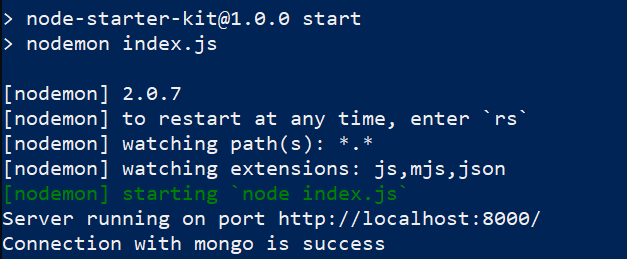

# Node Starter Kit

This is a nodejs starter kit. Authentication is already done with hashed password and connection is made to MongoDB.


### How to use this starter kit?

Click on Use this template on right above side and name the repo you want. A new repo of yours will be created. Now, clone this repo in your system. After cloning it into you system go inside the project folder<your-repo-name>.

- After moving into the folder run the following command to install all the dependencied
  ```
  npm install
  ```
- After installing all the dependencies go through the following commands to make a file named config.env config directory.
  ```
  touch config.env
  ```
- Edit config.env as follow :-
  ```
  PORT=8000
  MONGO_URI=<YOUR-MONGO-URI>
  ACCESS_TOKEN_SECRET=<YOUR-ACCESS-TOKEN-SECRET>
  ```
- After following all above steps, run the following command to start server
  ```
  npm start
  ```
- Expected Output in terminal
&ensp;&ensp;&ensp;

